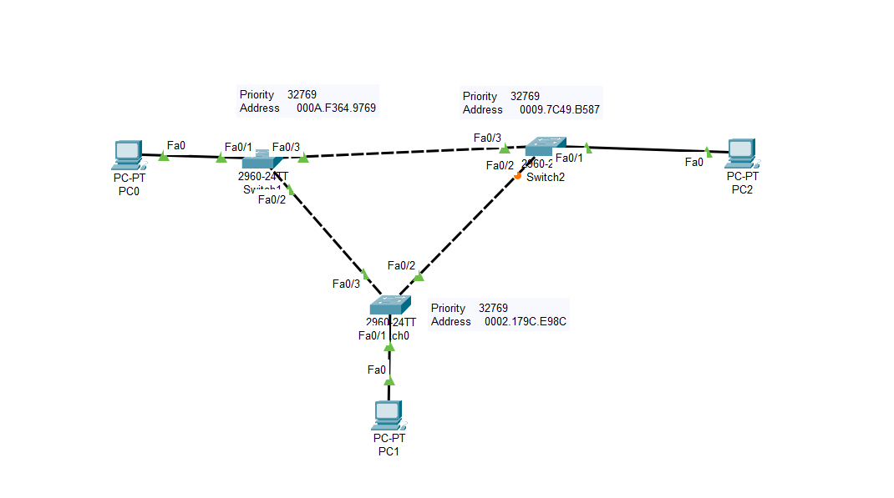

# Cisco Packet Tracer - Spanning Tree Protocol (STP) Lab

## 📖 Overview

This project demonstrates the implementation of the **Spanning Tree Protocol (STP)** using Cisco Packet Tracer. The network consists of three Cisco Catalyst 2960 switches connected in a triangular topology with redundant links. STP is used to prevent Layer 2 loops by automatically selecting the optimal forwarding path while blocking redundant links.

This lab provides a practical understanding of how STP ensures network stability and redundancy in switched Ethernet networks.

---

## 🖥️ Network Topology



### Topology Description

- **3 Cisco Catalyst 2960 Switches**
- **3 PCs**
- Redundant connections between switches
- One PC connected to each switch
- STP enabled by default on all switches

The redundant links create a potential switching loop, which is automatically prevented by STP through Root Bridge election and port state management.

---

## 🎯 Objectives

- Understand the purpose of Spanning Tree Protocol (STP).
- Prevent Layer 2 switching loops.
- Observe the Root Bridge election process.
- Identify Root Ports, Designated Ports, and Blocking Ports.
- Verify STP operation using Cisco IOS commands.

---

## 🛠️ Technologies Used

- Cisco Packet Tracer
- Cisco Catalyst 2960 Switches
- Ethernet Networking
- Spanning Tree Protocol (IEEE 802.1D)

---

## 📂 Project Structure

```
lab1/
│
├── stp1.pkt
├── README.md
└── screenshots/
    └── topology.png
```

---

## 🔍 Verification Commands

Use the following commands on the switches to verify the STP configuration:

```bash
show spanning-tree
show spanning-tree vlan 1
show spanning-tree brief
show running-config
show interfaces status
```

---

## ✅ Expected Results

- One switch is elected as the **Root Bridge**.
- Each non-root switch selects a **Root Port**.
- One redundant link is placed into the **Blocking State**.
- The network remains fully connected without Layer 2 loops.
- Communication between all PCs is maintained.

---

## 📚 Concepts Demonstrated

- Layer 2 Switching
- Spanning Tree Protocol (STP)
- Root Bridge Election
- Root Ports
- Designated Ports
- Blocking Ports
- Redundant Network Design
- Loop Prevention

---

## 🚀 How to Open the Project

1. Install **Cisco Packet Tracer 8.x or later**.
2. Open the file `stp1.pkt`.
3. Wait for STP to converge.
4. Run the verification commands on each switch.
5. Observe the Root Bridge election and blocked port.

---

## 📸 Screenshots

You can add additional screenshots in the `screenshots` folder, such as:

- Network Topology
- `show spanning-tree`
- Port Status
- Successful PC Connectivity (Ping)

---

## 👨‍💻 Author

**Tarik Hamraoui**

Computer Science Student | Networking Enthusiast

---

## 📄 License

This project is provided for educational purposes and may be freely used for learning and practice.
