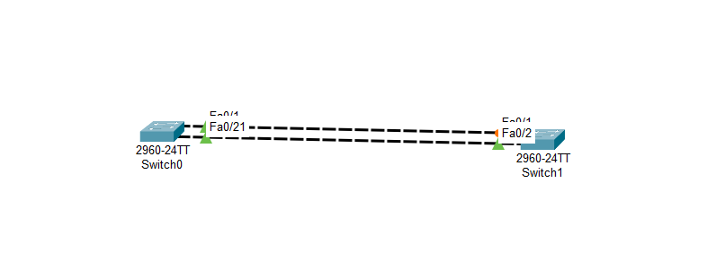

# Cisco Packet Tracer - Spanning Tree Protocol (STP) Lab

## 📖 Overview

This project demonstrates the operation of the **Spanning Tree Protocol (STP)** using Cisco Packet Tracer. Two Cisco Catalyst 2960 switches are connected by two redundant Ethernet links. STP automatically detects the redundant path and blocks one of the links to prevent Layer 2 switching loops while maintaining network redundancy.

This lab helps understand how STP ensures a loop-free topology and provides automatic failover if the active link fails.

---

## 🖼️ Network Topology



### Topology Description

- 2 × Cisco Catalyst 2960 Switches
- 2 Redundant Ethernet links
- STP enabled by default
- One link is placed in the **Forwarding** state.
- The second redundant link is placed in the **Blocking** state.

---

## 🎯 Objectives

- Understand the purpose of Spanning Tree Protocol (STP).
- Observe how STP prevents switching loops.
- Identify the forwarding and blocking ports.
- Verify STP operation using Cisco IOS commands.
- Understand network redundancy and automatic failover.

---

## 🛠️ Technologies Used

- Cisco Packet Tracer
- Cisco Catalyst 2960 Switches
- Ethernet Networking
- IEEE 802.1D Spanning Tree Protocol (STP)

---

## 📂 Project Structure

```
lab2/
│
├── stp2.pkt
├── README.md
└── screenshots/
    └── topology.png
```

---

## 🔍 Verification Commands

Run the following commands on both switches:

```bash
show spanning-tree
show spanning-tree vlan 1
show spanning-tree brief
show interfaces status
show running-config
```

---

## ✅ Expected Results

- One switch is elected as the **Root Bridge**.
- One physical link is in the **Forwarding** state.
- The redundant link is placed in the **Blocking** state.
- No Layer 2 loops occur.
- If the forwarding link fails, the blocked link automatically transitions to the forwarding state after STP convergence.

---

## 📚 Concepts Demonstrated

- Spanning Tree Protocol (STP)
- Root Bridge Election
- Forwarding Port
- Blocking Port
- Layer 2 Loop Prevention
- Network Redundancy
- Automatic Failover

---

## 🚀 How to Run

1. Open `stp2.pkt` in Cisco Packet Tracer 8.x or later.
2. Wait for STP to converge.
3. Open the CLI of each switch.
4. Run the verification commands.
5. Observe the blocked and forwarding ports.

---

## 📸 Screenshots

Store screenshots in the `screenshots` folder, such as:

- Network topology
- Output of `show spanning-tree`
- Port status before and after convergence

---

## 👨‍💻 Author

**Tarik Hamraoui**

Computer Science Student | Networking Enthusiast

---

## 📄 License

This project is shared for educational purposes. Feel free to use and modify it for learning and practice.
