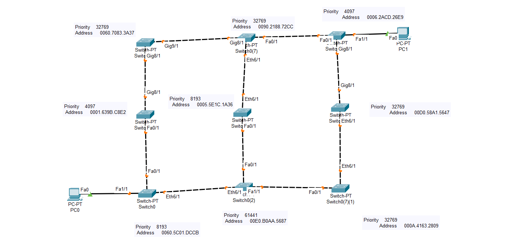

# Cisco Packet Tracer - Advanced Spanning Tree Protocol (STP) Lab

## 📖 Overview

This project demonstrates the implementation and behavior of the **Spanning Tree Protocol (STP)** in a complex Layer 2 network using Cisco Packet Tracer.

The topology consists of **nine Cisco switches** connected through multiple redundant links, creating several potential Layer 2 loops. Different bridge priorities are configured to control the Root Bridge election process, allowing observation of STP convergence and port state selection.

This lab provides practical experience with STP operation in a large switched network.

---

# 🖼️ Network Topology



---

## 🎯 Objectives

- Understand the purpose of Spanning Tree Protocol.
- Configure bridge priorities.
- Observe Root Bridge election.
- Identify Root Ports, Designated Ports, and Alternate (Blocking) Ports.
- Prevent Layer 2 loops.
- Verify STP convergence.
- Analyze the impact of different bridge priorities.

---

## 🏗️ Network Description

The topology contains:

- 9 Cisco Switches
- 2 PCs
- Multiple redundant Ethernet links
- Several possible Layer 2 loops
- Different bridge priorities configured on selected switches

Because multiple paths exist between switches, STP automatically builds a loop-free logical topology while preserving redundant paths for fault tolerance.

---

## ⚙️ Technologies Used

- Cisco Packet Tracer
- Cisco Catalyst Switches
- Ethernet Switching
- IEEE 802.1D Spanning Tree Protocol
- Cisco IOS CLI

---

## 📂 Project Structure

```
lab3/
│
├── stp3.pkt
├── README.md
└── screenshots/
    └── topology.png
```

---

## 🔍 Verification Commands

Execute the following commands on the switches:

```bash
show spanning-tree
show spanning-tree vlan 1
show spanning-tree root
show spanning-tree brief
show running-config
show interfaces status
```

---

## ✅ Expected Results

- One switch becomes the Root Bridge.
- The switch with the lowest Bridge ID is elected as the Root Bridge.
- Every non-root switch selects one Root Port.
- STP blocks redundant paths to eliminate switching loops.
- All end devices remain reachable.
- The network automatically reconverges if a link fails.

---

## 📚 Concepts Demonstrated

- Spanning Tree Protocol (STP)
- Root Bridge Election
- Bridge Priority
- Bridge ID
- Root Port
- Designated Port
- Alternate/Blocking Port
- Loop Prevention
- STP Convergence
- Network Redundancy
- Layer 2 Switching

---

## 🧪 Learning Outcomes

After completing this lab, you will be able to:

- Explain how STP prevents broadcast storms.
- Configure bridge priorities to influence Root Bridge election.
- Analyze STP topology using Cisco IOS commands.
- Understand port roles and states.
- Design fault-tolerant Layer 2 networks.

---

## 🚀 How to Run

1. Open **stp3.pkt** using Cisco Packet Tracer 8.x or later.
2. Allow STP to converge.
3. Access the CLI of each switch.
4. Execute the verification commands.
5. Observe the Root Bridge and blocked ports.

---

## 📸 Screenshots

The `screenshots` folder may include:

- Network topology
- Root Bridge election
- `show spanning-tree`
- Port roles and states
- Successful ping between PCs

---

## 👨‍💻 Author

**Tarik Hamraoui**

Computer Science Student | Networking Enthusiast

---

## 📄 License

This project is intended for educational purposes and may be freely used for learning, practice, and academic demonstrations.
